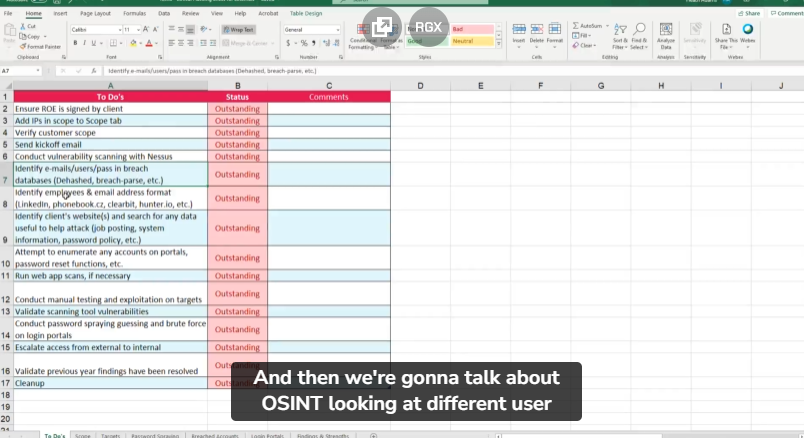
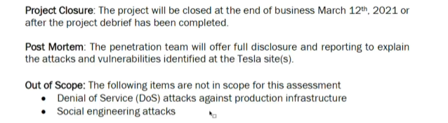
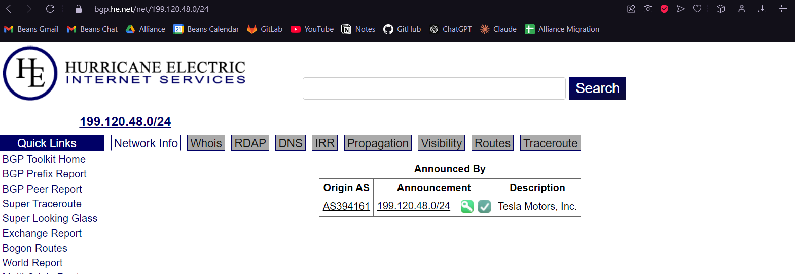

## External Pentest Playbook

- trying to hack into an organizaion from outside of that organization network. even we can't get their vpn. so what we can do? have different methodologies compared to web pentest.

## more focus on the methodologies

- the tools might change, but the methodologies don't change.

## Checklist, FTW

- prepare checklist
- to do
- scope
- target
- password spraying
- logon portal

## Rules of Engagement

please dont start do any pentest before rules of engagement signed.

## verifying scope

- this is very crucial, to avoid pentesting wrong scope or company.
  
  https://www.he.net

## Client Communication

-
