## External Pentest Playbook

- trying to hack into an organizaion from outside of that organization network. even we can't get their vpn. so what we can do? have different methodologies compared to web pentest.

## more focus on the methodologies

- the tools might change, but the methodologies don't change.

## Checklist, FTW

- prepare checklist
- to do
- scope
- target
- password spraying
- logon portal

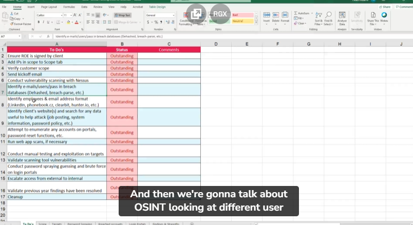

## Rules of Engagement

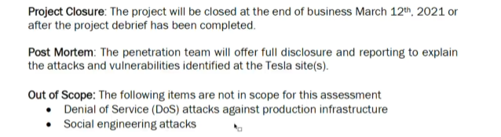
please dont start do any pentest before rules of engagement signed.

## verifying scope

- this is very crucial, to avoid pentesting wrong scope or company.
  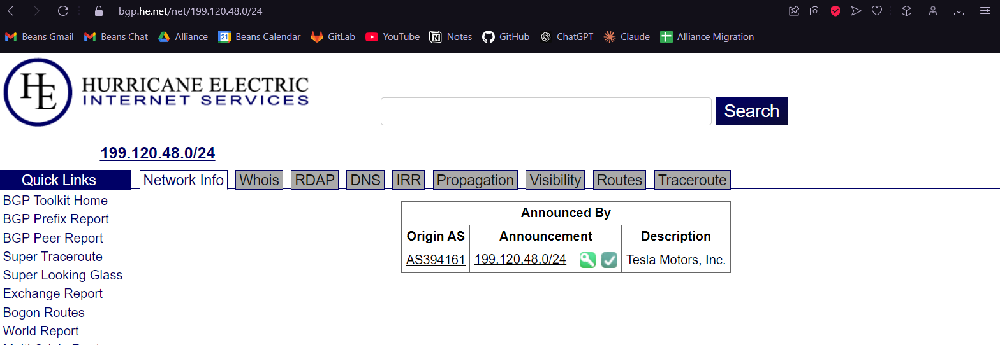
  https://www.he.net

## Client Communication

- inform client which scope will be tested within certain time, inform anycritical issue on the pentest scope.
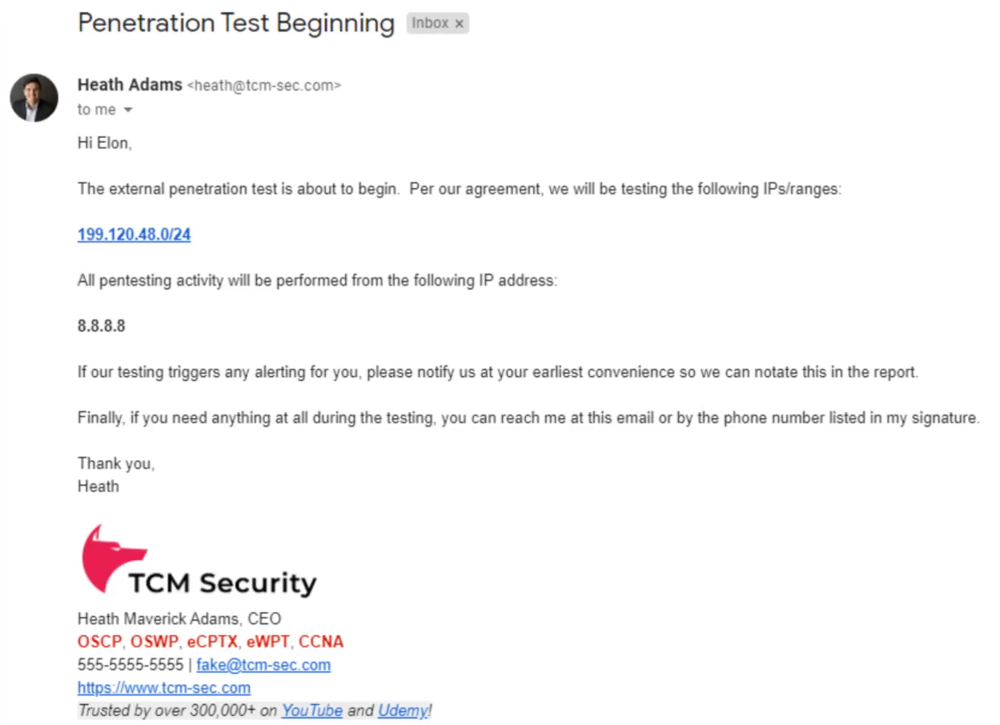

## Attack Strategy

- think of external pentest like home security
- low chance of rce, high chance of weak passwords
- OSINT is your best friend

## Vulneraboloty Scanning

- scan by using nessus
- better run on window lg smooth
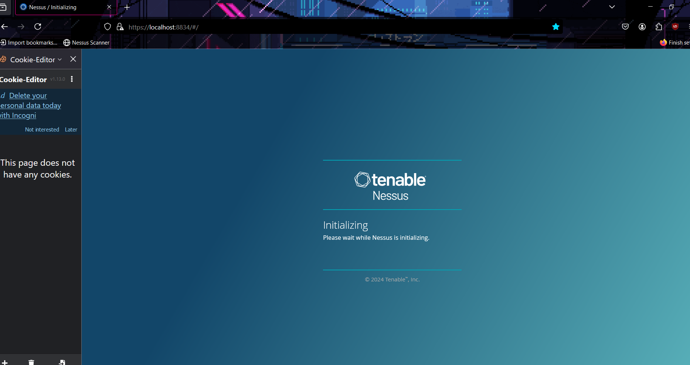
- nessus file report ni boleh export
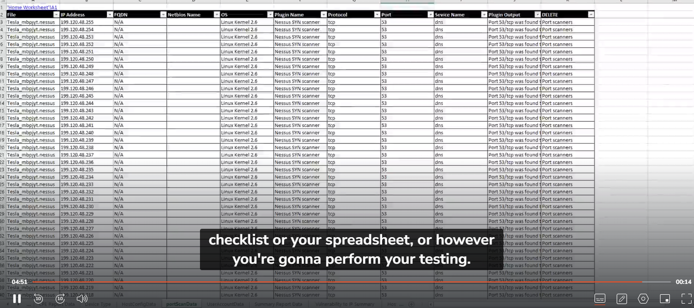

# OSINT Overview

## Hunting Breach Credential

- breach parser
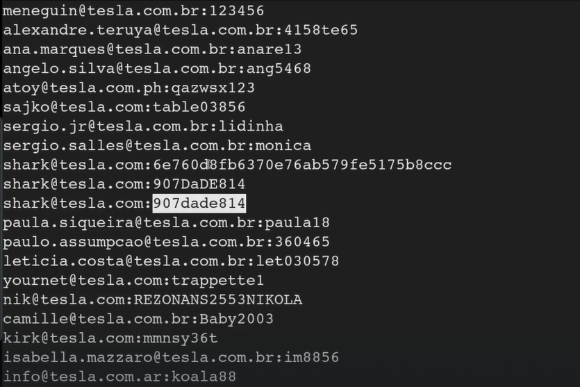
- can confirm and geet some pattern of the username and password. such as email will consist of firstname and last name.

## Weak password requirement policy

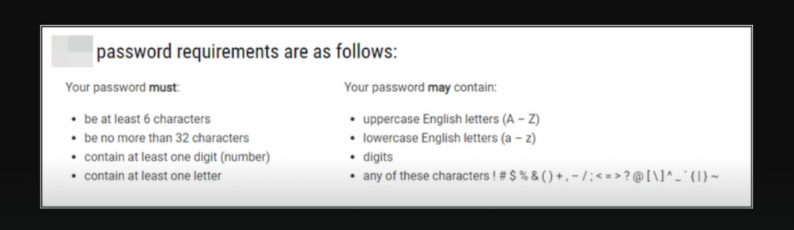

## Attacking login portals

 - login portal to attack
 - list of possible employees/emails
 - password strategies to employ
 - identify password policy (penting part ni)
 - password boleh jadi lebihkurang jer macam username/email
 - tukar huruf dengan nombor tesla = tesl4

 ## Password Spraying O365

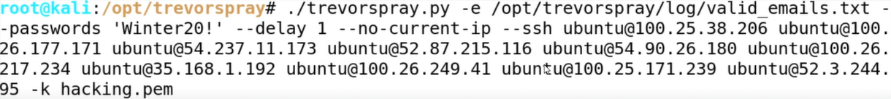
*hacking.pem ni datang dari aws punya ec2

trevorspray: by right the picture dont use current ip address to perform spray, they used diff vps to avoid get blocked from the spray.

before spraying kne tahu account lock out policy. kadang bila 5 kali dah salah nnti die akan. block account daripada log in.

 ## Password Spraying OWA (Outlook Web Access)

 tool: metasploit
 - search owa
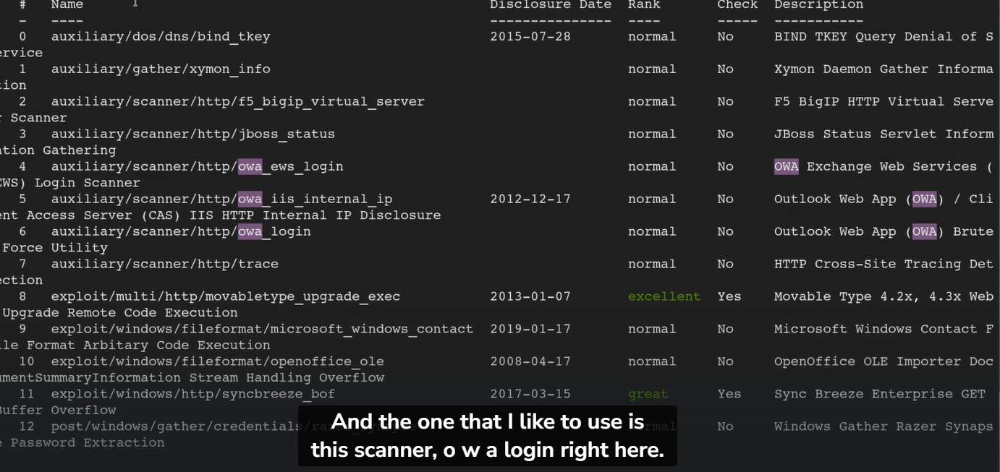 : use 6

## Attacking other portals
pakai intruder burpsuite

## Bypass MFA

- MFSweep

## Common Pentest Finding

- insifficient Authentication Controls
- Weak Password Policy (OSINT) check on sign up
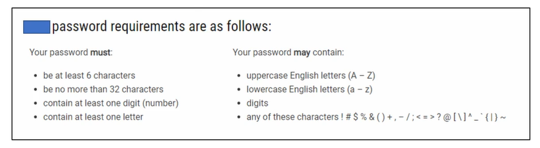
- insufficient patching
- default credential
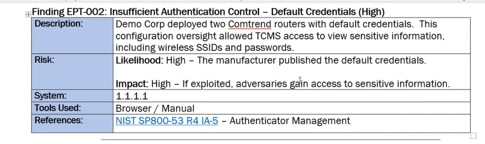
- insufficient encryption
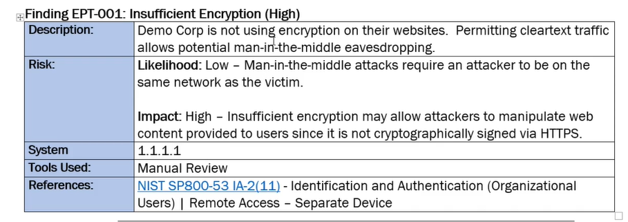
- information disclosure
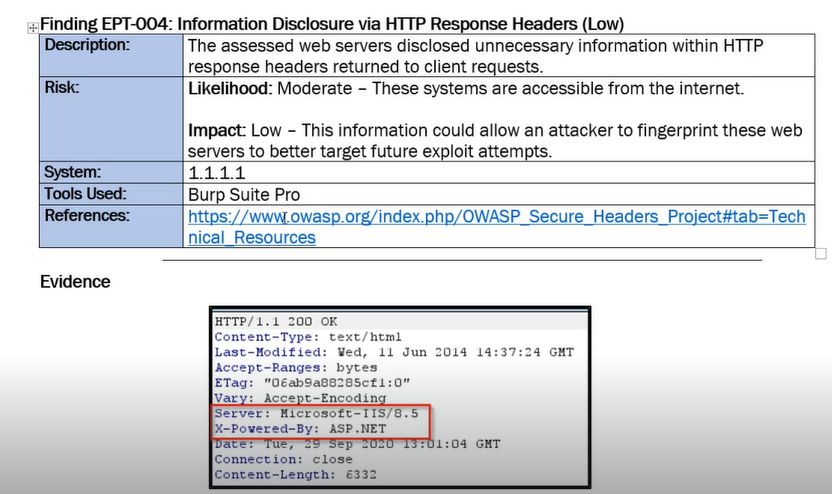
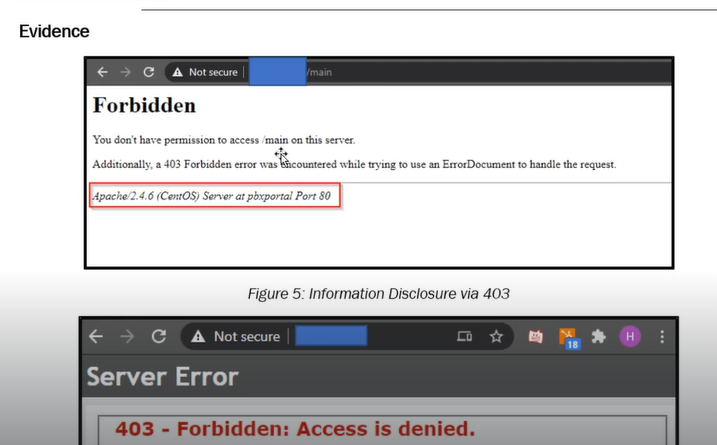
- username enumeration
- default web pages (apache, tomcat, phpinfo)
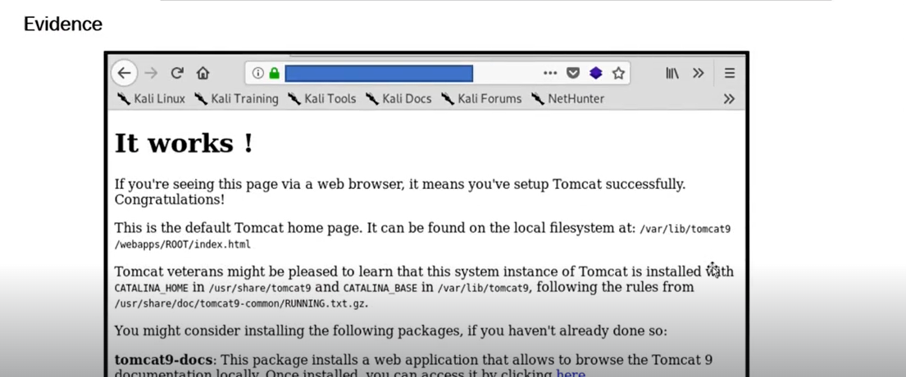
- open mail relay
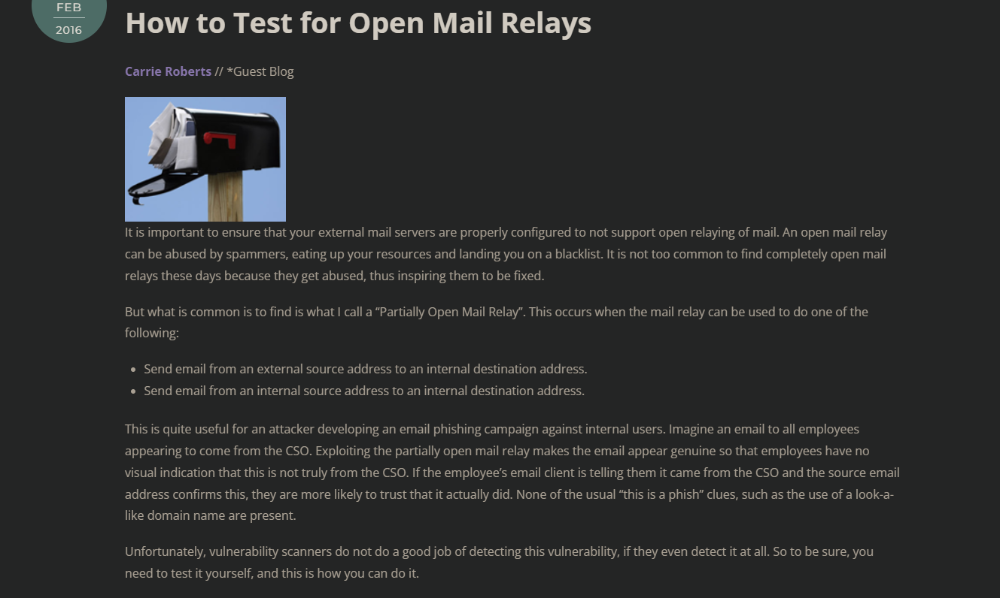
https://www.blackhillsinfosec.com/how-to-test-for-open-mail-relays/
- IKE (Internet Key Exchange) Aggresive mode
- unexpected Perimeter Services
- insufficient traffic blocking
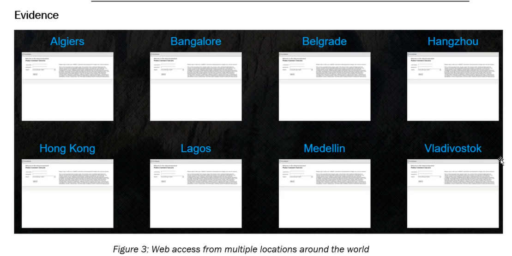
sepatutnya block website dekat company yg tak berkaitan.
- undetected malicious activity
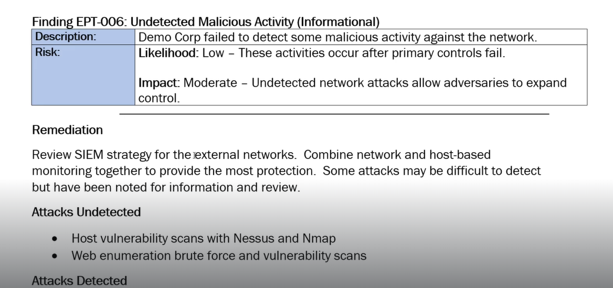
- Historical Account Comproise
avoid repeat the same password

## Client Debriefs
