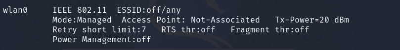

## OS Information Gathering
- hostname
- uname -a 
- cat /proc/version
- cat /etc/issue
- lscpu
- ps aux (tgk service running)
- ps aux | grep root (tgk yg run under root)
- whoami
- id
- sudo -l
- cat /etc/passwd
- cat /etc/passwd | cut -d: -f 1
- cat /etc/shadow
- cat /etc/group
- history

## Network Information Gathering
- ifconfig
- ip a
- ip route
- arp -a
- ip neigh
- netstat -ano (check port, communication)

## Password Hunting
- grep —color=auto -rnw ‘/’ -ie “PASSWORD” —color=always 2>dev/null
- grep —color=auto -rnw ‘/’ -ie “PASSWORD=” —color=always 2>dev/null
- locate password | more
- locate passwd | more
- find / -name id_rsa 2>/dev/null
- find / -name authorized_keys  2> /dev/null

## Automated tools
- [LinPeas](https://github.com/carlospolop/privilege-escalation-awesome-scripts-suite/tree/master/linPEAS)
- [LinEnum](https://github.com/rebootuser/LinEnum)
- [Linux Exploit Suggestor](https://github.com/mzet-/linux-exploit-suggester)
- [Linux Priv Checker](https://github.com/sleventyeleven/linuxprivchecker)

## Kernel Exploits

Tools: [Kernal Exploits](https://github.com/lucyoa/kernel-exploits)

- Get kernal version
  

- Search for exploit
  

- Run Exploit Suggestor
  

## Escalation via Stored Passwords
- history
- cat .bash_history
- [Looting for password](https://swisskyrepo.github.io/InternalAllTheThings/redteam/escalation/linux-privilege-escalation/#checklists)

## Escalation via Weak File Permissions
