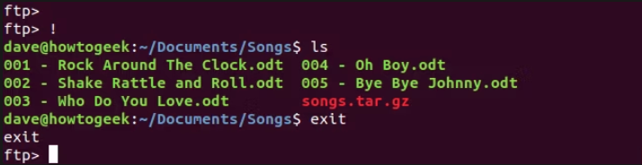

## basic ftp comands

- establish connection

```bash
ftp <ip-address>
```

- show files

```bash
ftp <ip-address>
```

- retrieve file

```bash
get <file-name>
```

- retrieve multiple files at once

```bash
mget *.c
```

- uploud file to the ftp server

```bash
mget *.c
```

- access local computer while connect to ftp



## basic ftp comands

