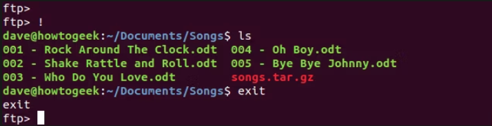
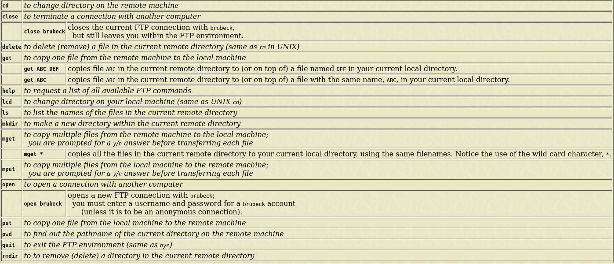
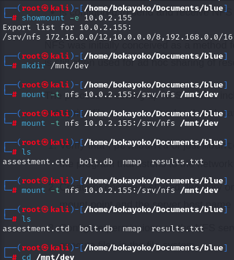
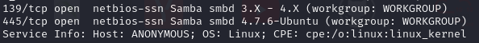
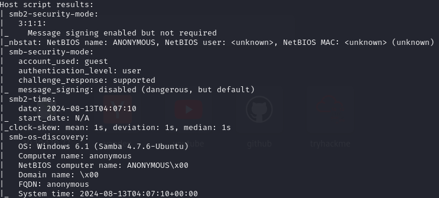
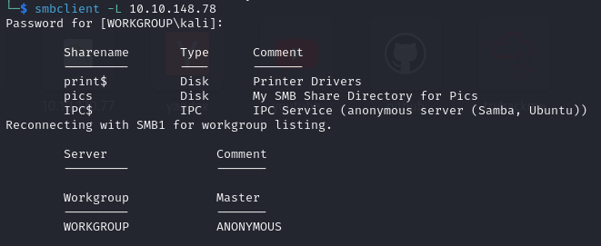

## basic ftp comands

- establish connection

```bash
ftp <ip-address>
```

- show files

```bash
ftp <ip-address>
```

- retrieve file

```bash
get <file-name>
```

- retrieve multiple files at once

```bash
mget *.c
```

- uploud file to the ftp server

```bash
mget *.c
```

- access local computer while connect to ftp



Others



## Establish Connection of Network File Sharing

//nak tengok folder apa yang kita boleh amik untuk mount

```bash
showmount -e [ip address] 
```

//buat file dlu utk tempat nak mountkan, 

```bash
mkdir /mnt/[vm name]
```

//execute mount 

```bash
mount -t nfs [ip address]:[directory] /mnt/[vm name]
```

 The /mnt directory is often used as a mount point for external or temporary file systems, and it's not typically the location for storing SSH keys.

Example:


## Samba file server







[more information](https://medium.com/@ibo1916a/smbclient-command-2803de274e46)