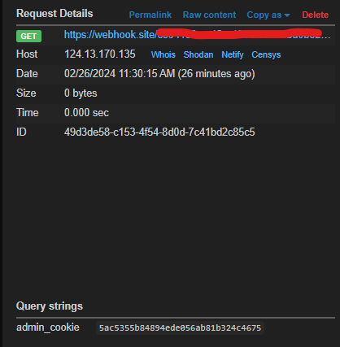

### System enumeration
- systeminfo
- systeminfo | findstr /B /C:"OS Name" /C:"OS Version" /C:"System Type"
- hostname
- wmic qfe (get patch history)
- wmix qfe get Caption,Description,HotFixId,InstalledOn
- wmic logicaldisk get caption,description,providername

## User Enumeration
- whoami
- whoami /priv
- whoami /groups
- net user
- net user MSI
- net localgroup
- net localgroup administrator

## Network Enumeration
- ipconfig
- ipconfig /all
- arp -a
- netstat -ano

## Password Hunting
- findstr /si password *.txt
- findstr /si password *.txt *.ini *.config 
- dir /s *pass* == *cred* == *vnc* == *.config*
- findstr /spin "password" *.*
- findstr /spin "password" *.*

best reference: https://sushant747.gitbooks.io/total-oscp-guide/content/privilege_escalation_windows.html

## Wifi password
- netsh wlan show profile
- netsh wlan profile <SSID> key=clear

## Firewall
- sc query windefend (check firewall run)
- sc queryex type= service (check semua running process)
- netsh firewall show state
- netsh firewall show config
